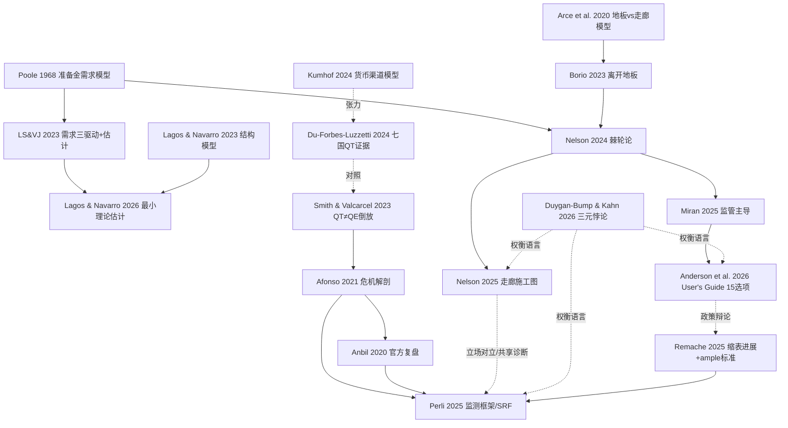

# 缩表之争：美联储资产负债表管理文献综述（2020–2026）

> 基于 [[Fed_Balance_Sheet_Research/README|16 篇文献库]] 的批判性梳理。
> 核心问题：**美联储资产负债表（峰值约 9 万亿、占 GDP 35%；2026 年约 6.6 万亿、21%）还能缩多少？怎么缩？缩之前要先改什么？**

---

## 〇、一页总览

这套文献构成一条完整的论证链，五个环节环环相扣：

1. **概念地基**：准备金需求曲线是理解一切的钥匙——它是非线性的、会移动的、且被监管深度塑造（LS&VJ 2023；Lagos & Navarro 2026）。
2. **历史教训**：2017–19 年缩表证明 QT 不是 QE 的镜像，2019 年 9 月回购危机证明"充裕（ample）"的位置会动（Smith & Valcarcel 2023；Afonso et al. 2021）。
3. **权衡语言**：央行资产负债表存在"三元悖论"——小表、稳利率、少干预不可兼得（Duygan-Bump & Kahn 2026）。
4. **路线之争**：先改监管压低准备金需求再缩表（Miran 2025；Anderson et al. 2026），还是干脆回到稀缺准备金的走廊框架（Nelson 2024/2025；Borio 2023），抑或维持现状谨慎前行（Perli、Remache 2025）。
5. **边界条件**：全球经验显示 QT 影响"比看油漆干大、比 QE 逆转小"（Du, Forbes & Luzzetti 2024），但货币渠道模型警告永久 QT 的真实成本（Kumhof & Salgado-Moreno 2024）。

---

## 一、问题缘起：一张"停不下来"的资产负债表

美联储资产负债表从危机前占 GDP 约 5–6% 膨胀到 2022 年峰值约 35%，经 2022–25 年缩表后降至约 21%（6.6 万亿美元）。为什么缩到这里就"缩不动"了？

**Nelson (2024)** 给出了最有冲击力的叙事：2008 年 4 月，美联储内部评估认为用"超额准备金"实施货币政策是"激进偏离"，予以否决；六周后雷曼倒闭，这个被否决的方案被迫上线，并在 2019 年 1 月被 FOMC 永久化。Nelson 认为这是一个**错误**，其核心机制是**准备金需求的棘轮效应（ratchet）**：

- 2008 年 4 月，联储估计运行地板系统需要 **350 亿美元**准备金（银行资产的 0.3%）；
- 2018 年 11 月正式采纳地板框架前，估计升至 **1 万亿**；
- 不到一年后升至 **1.46 万亿**；到 2022 年纽约联储预测口径已达 **2.3 万亿**，2025 年末结束 QT 时实际落在 **3 万亿**附近——比最初估计高 86 倍。

棘轮的成因是多重的：银行与检查员习惯了廉价充裕的准备金（Nelson）；存款规模（甚至相对 GDP）持续增长推高交易性需求（LS&VJ）；银行资产负债表结构变化（更多授信额度）推高预防性需求（Acharya et al.）；而 LCR、内部流动性压力测试（ILST）、处置计划等**监管要求**则把大量准备金需求变成"刚性"（Miran 的"监管主导"论）。

**批判性评注**：Nelson 的叙事极具说服力但立场鲜明（BPI 代表银行业利益，"承认贴现窗口额度=减少银行资产负债表占用"直接利好银行）。阅读时应与官方执行层（Perli/Remache）的谨慎立场对照——后者强调充裕准备金框架自 2008 年以来利率控制近乎完美（EFFR 仅两天出区间），且地板框架支撑了回购与国债市场的融资韧性。

---

## 二、概念地基：准备金需求——非线性、会移动、被监管塑造

### 2.1 López-Salido & Vissing-Jorgensen (2023)：可操作的定量框架

本轮全部讨论的定量起点。准备金需求三大驱动：

$$EFFR - IOR = \text{便利收益}(R, D) - \text{资产负债表成本}$$

- **利差**：EFFR 与准备金利率之差，衡量持有准备金的机会成本；
- **便利收益**：准备金用于管理存款进出的交易便利，**随存款规模上升而上升**——这是"需求曲线会右移"的微观基础；
- **资产负债表成本**：监管资本（尤其 SLR）使"借市场钱、存联储"的套利有成本，限制需求弹性。

关键实证：2009M1–2022M10 半弹性约 **−5**；**控制存款增长后需求曲线出人意料地稳定**。政策含义有两层：(a) 给出 iso-联邦基金曲线，可指导 IORB 相对目标区间中点的设定；(b) 以 2022 年 10 月存款水平计，**准备金+ONRRP 至少还可缩 2 万亿美元**才会引发利率波动——但若存款继续增长，下限会相应抬升。

### 2.2 Lagos & Navarro (2026, NBER 34972)：方法论纠偏

直指 LS&VJ 一类"无理论"约简式估计的三宗罪：函数形式任意导致外推性差、违反理论形状约束、无法识别监管/市场结构变化引起的曲线旋转。他们提出**"最小理论"（minimal-theory）估计**——在计量设定中嵌入任何准备金需求都必须满足的核心约束（如在 Q→0 时贴近上渐近线），并控制管理利率利差变化导致的曲线旋转。结果与其结构模型（Lagos & Navarro 2023, NBER 31370）交叉验证：若以"99% 概率 EFFR–IOR 利差不超过 10bp"为标准，**充裕准备金的下限约为 1.3 万亿（结构估计）至 1.7 万亿（最小理论 logistic 估计）**。

**批判性评注**：两组估计（LS&VJ 的"还能缩 2 万亿" vs Lagos & Navarro 的"下限 1.3–1.7 万亿"）看似冲突，实则度量对象不同：前者是 2022 年时点相对存款条件的冗余量，后者是危机前样本期（2014–2019）的绝对下限，且都明确承认下限随存款、监管与结构因素移动。真正的分歧在于**外推可信度**——而这正是 2019 年 9 月摔倒的地方。

### 2.3 Duygan-Bump & Kahn (2026)：三元悖论——最好的"权衡语言"

FEDS Notes 提出央行资产负债表**三元悖论**：以下三者只能同时得到两个——

| 想要 | 代价 |
|---|---|
| 小资产负债表 + 低利率波动 | 必须**频繁市场干预**（主动 OMO 误判会放大波动；被动常设工具则弱化市场纪律） |
| 小资产负债表 + 少干预 | 必须**容忍利率波动**（极端情形有金融稳定后果） |
| 低利率波动 + 少干预 | 必须**大资产负债表**（footprint 大、市场信号扭曲、财政化风险） |

这篇笔记的价值在于把"地板 vs 走廊"之争从立场之争转化为**选择哪组代价**的权衡问题。Anderson et al. (2026) 的 15 项选项、Perli 的 RMP 框架，本质上都是在三元悖论的约束面上选点。

---

## 三、历史教训：2017–19 QT 与 2019 年 9 月回购危机

### 3.1 Smith & Valcarcel (2023, JEDC)：QT ≠ QE 的倒放

对 2017–19 年缩表的事件研究 + 结构 VAR，核心发现：**缩表确实收紧金融条件，但机制与 QE 不对称**——没有 QE 那样巨大的公告效应，影响在**实施过程中**通过更大的**流动性效应**逐渐浮现。这解释了为什么 QT 容易"温水煮青蛙"：市场平静期可能只是在积累压力。

### 3.2 Afonso et al. (2021, NY Fed SR 918) 与 Anbil et al. (2020, FEDS Notes)：危机解剖

2019 年 9 月 16–17 日：公司缴税截止日 + 国债拍卖结算叠加，准备金总量虽已"充裕"，但**分布**高度集中于少数大行且这些银行因日内流动性与监管约束不愿出借，SOFR 一度飙至 8%+，EFFR 短暂突破区间上限。两篇复盘共同的政策遗产：

- **"ample"是个移动靶**——需求曲线的陡峭段随存款、监管、习惯右移（Nelson 棘轮论的经验根基）；
- 总量指标不够，必须盯**分布指标与货币市场相对价格**（SOFR–IORB、回购在美债曲线中的位置）——这直接催生了 Perli 时代纽约联储的监测体系和 2021 年 SRF 的设立；
- 缩表速度必须**慢于**需求曲线下移的速度，否则就是重演 2019。

---

## 四、国际与理论证据：QT 的代价到底有多大？

### 4.1 Du, Forbes & Luzzetti (2024, NBER 32321)：七国跨国证据

覆盖澳、加、欧元区、新西兰、瑞典、英、美。要点：

- QT 公告使国债收益率上升约 **4–8bp**（1 年期以上），2021–23 累计约 **20–26bp**，曲线变陡；对其他金融指标影响有限；
- **主动 QT（出售）比被动 QT（到期不续）影响大**，尤其在长端；
- 实施层面：隔夜融资利差温和上升、国债便利收益下降，但**未显著损害国债定价与市场流动性**；
- 央行退出后，**国内非银部门**基本承接了债券供给——这在国债发行高企的当下是关键的缓冲证据。

作者的名言式结论：QT 的影响**"比看油漆干大，但远小于逆转危机期 QE"**；迄今平稳，但未来摩擦可能上升——届时会像"看水烧开"。Lorie Logan（达拉斯联储主席，2024 USMPF 评论）补充了第二层不对称：资产市场影响小，但**融资市场**才是 QT 的脆弱点。

### 4.2 Kumhof & Salgado-Moreno (2024, BoE WP 1090)：货币渠道的理论警告

DSGE 模型中银行通过存款创造放贷——银行没有"融资风险"，只有**准备金结算层面的"再融资风险"**。由此：

- **永久性 QT 有显著负面金融与实际效应**：提高准备金稀缺部门的货币创造成本，即便它降低均衡实际利率；
- 临时性净存款流出（如 TGA 吸水）的影响**高度不对称**——即使总量充裕，分布不均也会伤害局部；
- **逆周期准备金数量规则**的福利贡献可与泰勒规则相当——"数量"应当重新成为常规政策变量。

**批判性评注**：这篇从理论侧呼应了 Afonso 的分布教训，并与 Du-Forbes-Luzzetti 的"迄今平稳"形成张力——跨国证据度量的是常态期，模型描述的是尾部。两者不是矛盾，而是提醒：QT 的定价函数在需求曲线陡峭段是凸的。

---

## 五、制度设计之争：地板 vs 走廊

### 5.1 Arce, Nuño, Thaler & Thomas (2020, JME)：学术基准模型

含**匹配摩擦银行间市场**的新凯恩斯模型。资产负债表扩张通过"**银行间传导渠道**"使市场利率贴向地板。两个关键结论：

1. **地板体制提供更大政策空间**：稳态存款便利利率更高、离有效下限（ELB）更远，降息弹药更足；
2. 但**"小表 + 衰退时及时临时 QE"可以达到与大表地板相近的稳定与福利结果**——大表并非必需，**速度**比存量更重要。

这篇常被双方各自引用：地板派取结论 1，走廊派取结论 2。公允地说，它证明的是"走廊+果断 QE"是可行替代，但对"QE 本身是否有超出模型的政治经济成本"（Nelson 担心的财政化、Acharya 担心的流动性依赖）保持沉默。

### 5.2 Borio (2023, BIS WP 1100) 与 Nelson (2024/2025)：走廊派施工图

Borio 系统论证地板系统的隐性成本：市场纪律弱化、银行间市场萎缩、央行 footprint 自我膨胀、货币政策财政化。Nelson (2025) 则给出完整施工图，要点：

- **点目标**而非区间（2008 年改区间只是零利率下的临时不确定）；
- **100bp 走廊**：一级信贷利率为目标 +50bp，IOER 为目标 −50bp；
- **每日公开市场操作**——"设定后不管"是幻想；
- **贴现窗口额度视同准备金**：预先抵押的借款能力在经济上等于准备金，监管应承认其 HQLA 地位——这是压低准备金需求最便宜的一招，也被 Anderson et al. (2026) 列为选项 1–3 的量化对象；
- **自愿准备金目标制（VRT）**：银行自报目标、目标内按接近目标利率付息，兼顾弗里德曼规则与利率控制；
- **TGA 自动投资回购**以灭菌其波动；**不再 QE**（压长端利率应交给财政部发债管理）。

### 5.3 Miran (2025) 与 Anderson, Barbarino, Diercks & Miran (2026, FEDS 2026-019)：第三条路——"监管主导"与缩表菜单

Miran 演讲的核心洞见：**稀缺/充裕/丰富的边界不是自然常数，而是被监管决定的**——LCR、ILST、处置计划流动性要求、SLR 共同抬高了准备金需求曲线。因此"先讨论缩表再讨论监管"是把马车放在马前面。改革监管可以**下移**这些边界，从而在不回到稀缺准备金的条件下缩表。

《User's Guide》把这个思路工程化：15 项选项 + 蒙特卡洛加总，结论是在**维持充裕准备金框架**内可缩表 **1.2–2.1 万亿美元**（95% 置信区间），把资产负债表带回 GDP 的 15–17.5%（2009 或 2012/2019 年水平）。菜单按机制分组：

- **降监管性需求**（选项 1–4）：LCR 承认贴现窗口能力（中值 2500 亿）、压力期 LCR 再校准、ILST 承认贴现窗口、处置计划流动性要求——单项最大，合计中值约 5500 亿；
- **降持有收益**（选项 7）：EFFR 运行在 IORB 之上（中值 3500 亿）；
- **提升替代品吸引力**（选项 9–10）：扩大 FIMA 回购（84 天期限、更高限额+更高折扣率）、以互换线承诺+外国监管协调化解 FBO 的预防性需求（外资行近 1 万亿准备金，可降至多 20%）；
- **非准备金负债**（选项 14–15）：TGA 部分移回商业银行（现代化 TT&L，中值 3000 亿）、抑制外国逆回购池；
- **操作层**（选项 11–13）：SRP 去耻感/延长窗口/中央清算、TGA 波动以国库券灭菌、Fedwire 流动性节约机制（中值 1125 亿）。

同时作者反复强调：这是**菜单不是背书**；实施需一年以上规则制定；必须慢，确保市场能消化联储退出后重新发行的证券。

**批判性评注**：这条"第三条路"在政治可行性上明显优于 Nelson 的框架革命（不需动框架、可分项推进），其量化是本文献集中最细的。但三点保留：(a) 多数大项（LCR/ILST/处置计划）需银行监管机构协同，Fed 单方面推不动，且 2026 年监管议程本身充满不确定性；(b) 蒙特卡洛加总假设各选项减需求效应近似独立，实际上 LCR 改革与 ILST 改革高度重叠，1.2–2.1 万亿或偏乐观；(c) "EFFR 高于 IORB"本质是向轻度稀缺移动，与作者"不回稀缺"的自我定位存在张力——Miran 本人在访谈中承认这是"降低边界"而非"回到稀缺"，边界 semantics 之争仍在继续。

---

## 六、官方执行层：Perli 与 Remache 的谨慎立场

**Remache (2025-09，一级交易商年会)** 与 **Perli (2025-11，美债市场会议)** 代表纽约联储交易台（SOMA）的官方框架（注意：前者在部分清单中被误标为 Perli 演讲）：

- 缩表第一阶段（2022–25）几乎全部由 **ON RRP 从 2 万亿降至近零**吸收，准备金本身未降——"真正考验才刚开始"；
- 此后转为**准备金管理购买（RMP）**：以需求预测（TGA、通货）+ SFOS 需求调查 + 货币市场状况三位一体，逐月校准购买量，目标不是某个准备金数字而是"利率控制 + 低波动"；
- Perli（2026 年 5 月延续此框架）明确画出两条路线的分野：**移需求曲线**（监管改革→降低充裕区间→Desk 减购/恢复缩表，利率控制不受损）vs **沿需求曲线下移**（直接减供给→利率持续高于 IORB 且波动放大，"经验显示即便温和高于 IORB 也会迅速扰乱货币市场并传导至国债市场"）——官方明显倾向前者，与 Miran 路线在"先降需求"上其实存在交集；
- SFOS 证据：银行自己也认为**流动性监管改革**是未来两年降低其合意准备金水平的最重要驱动，风险偏向下行——为"监管主导"论提供了来自需求方的佐证。

---

## 七、综评：共识、分歧与未决问题

### 七点共识

1. 准备金需求曲线**非线性且会移动**，"ample"是移动靶（全部文献）；
2. **监管（LCR/ILST/SLR/处置计划）是当前需求曲线位置的主要决定因素**之一（Miran、Nelson、User's Guide、SFOS、Trilemma 脚注）；
3. 2019 年 9 月的教训是**分布与监测**，不是简单的总量不足（Afonso、Anbil、Perli）；
4. **QT ≠ QE 倒放**：公告效应小、实施效应大、流动性渠道更突出（Smith & Valcarcel、DFL）；
5. 缩表必须**慢**，且需要吸收机制应对证券再发行（User's Guide、DFL 的非银承接证据）；
6. 常设回购工具（SRF/SRP）+ 去耻感化是任何路线的**必要基础设施**（User's Guide 选项 11、Nelson、Perli）；
7. 主动 QT 影响大于被动 QT，长端更敏感（DFL）。

### 三大真分歧

1. **框架之争**：走廊（Nelson、Borio）vs 充裕地板+降需求（Miran、User's Guide）vs 维持现状（Perli/Remache 执行层）。实质是三元悖论上选哪个点，以及**利率波动的社会成本**如何定价；
2. **还能缩多少**：Lagos & Navarro 的绝对下限（1.3–1.7 万亿，危机前样本） vs LS&VJ 的冗余量（≥2 万亿，2022 年存款条件） vs User's Guide 的"改监管后 1.2–2.1 万亿"——三个数字度量对象不同，但对政策节奏的含义相反；
3. **"EFFR 高于 IORB"算不算回稀缺**：User's Guide 选项 7 的中值贡献（3500 亿）恰是最大的单项之一，其定位决定了"第三条路"是否名实相符。

### 未决问题（值得跟踪）

- 存款相对 GDP 的持续上升是否会永久右移需求曲线（LS&VJ 机制的动态化）；
- 稳定币与代币化存款对准备金需求结构的冲击（本清单尚未覆盖）；
- 财政主导风险下，TGA 管理与发债结构对 QT 边界的约束（Vissing-Jorgensen 2025 TGA Notes、Nelson 的财政部替代方案）；
- 非银承接国债的容量极限与脆弱性（DFL 的发现能否外推到更高发行强度）。

---

## 八、文献关系图

---

## 九、推荐阅读路径

| 目标 | 路径 |
|---|---|
| 30 分钟建立框架 | Trilemma → User's Guide 摘要与 Table 1 |
| 理解定量基础 | LS&VJ（重点 §3–§6）→ Lagos & Navarro 引言与结论 |
| 理解 2019 教训 | Anbil（短）→ Afonso（深）→ Smith & Valcarcel 摘要 |
| 理解路线之争 | Miran 演讲 → Nelson LinkedIn 文 → Borio → Perli 2025-11 |
| 追踪当前政策 | User's Guide → Remache/Perli → SFOS 最新一期 |

---

## 十、参考文献（本地文件）

> 📓 16 篇均已逐篇精读并撰写读书笔记，见 [[Fed_Balance_Sheet_Research/README#读书笔记（16 篇逐篇精读）|读书笔记目录]]（`Fed_Balance_Sheet_Research/读书笔记/`），每篇含核心论点、关键数字与批判性评注。

**01 核心论文**
1. Anderson, Barbarino, Diercks & Miran (2026). [A User's Guide to Reducing the Federal Reserve's Balance Sheet, FEDS 2026-019](Fed_Balance_Sheet_Research/01_Core_Papers/Anderson_Barbarino_Diercks_Miran_2026_Users_Guide_Reducing_Fed_Balance_Sheet_FEDS2026-019.pdf)
2. Nelson (2024). [How the Federal Reserve Got So Huge (BPI SWP 2024-1，部分正文)](Fed_Balance_Sheet_Research/01_Core_Papers/Nelson_2024_How_the_Fed_Got_So_Huge_BPI_SWP2024-1_部分正文.md) — 完整版 DOI: 10.1002/soej.12732
3. Miran (2025). [Regulatory Dominance of the Federal Reserve's Balance Sheet](Fed_Balance_Sheet_Research/01_Core_Papers/Miran_2025_Regulatory_Dominance_Speech.pdf)
4. Nelson (2025). [Forward Guidance: Remodeling the House After Tearing Up the Floor](Fed_Balance_Sheet_Research/01_Core_Papers/Nelson_2025_Forward_Guidance_Remodeling_the_House_LinkedIn.md)

**02 准备金需求框架**
5. López-Salido & Vissing-Jorgensen (2023). [Reserve Demand, Interest Rate Control, and QT](Fed_Balance_Sheet_Research/02_Reserve_Demand_Framework/Lopez-Salido_Vissing-Jorgensen_2023_Reserve_Demand_IRC_QT_ECB.pdf)
6. Lagos & Navarro (2026). [Reserve Demand Estimation with Minimal Theory, NBER 34972](Fed_Balance_Sheet_Research/02_Reserve_Demand_Framework/Lagos_Navarro_2026_Reserve_Demand_Estimation_Minimal_Theory_NBER34972.pdf)
7. Duygan-Bump & Kahn (2026). [The Central Bank Balance-Sheet Trilemma](Fed_Balance_Sheet_Research/02_Reserve_Demand_Framework/Duygan-Bump_Kahn_2026_Balance_Sheet_Trilemma_FEDSNotes.html)

**03 全球 QT**
8. Du, Forbes & Luzzetti (2024). [QT Around the Globe, NBER 32321](Fed_Balance_Sheet_Research/03_Global_QT_Comparison/Du_Forbes_Luzzetti_2024_QT_Around_the_Globe_NBER32321.pdf)
9. Kumhof & Salgado-Moreno (2024). [QE and QT: The Money Channel, BoE WP 1090](Fed_Balance_Sheet_Research/03_Global_QT_Comparison/Kumhof_SalgadoMoreno_2024_QE_QT_Money_Channel_BoE_WP1090.pdf)

**04 制度设计**
10. Borio (2023). [Getting up from the Floor, BIS WP 1100](Fed_Balance_Sheet_Research/04_System_Design/Borio_2023_Getting_up_from_the_Floor_BIS_WP1100.pdf)
11. Arce, Nuño, Thaler & Thomas (2020). [A Large Central Bank Balance Sheet? Floor vs Corridor](Fed_Balance_Sheet_Research/04_System_Design/Arce_Nuno_Thaler_Thomas_2019_Floor_vs_Corridor_WP.pdf)

**05 2019 回购危机**
12. Afonso et al. (2021). [The Market Events of Mid-September 2019, NY Fed SR 918](Fed_Balance_Sheet_Research/05_2019_Repo_Crisis/Afonso_et_al_2021_Market_Events_Mid-September_2019_NYFed_SR918.pdf)
13. Anbil, Anderson & Senyuz (2020). [What Happened in Money Markets in September 2019?](Fed_Balance_Sheet_Research/05_2019_Repo_Crisis/Anbil_Anderson_Senyuz_2020_Money_Markets_Sept2019_FEDSNotes.html)
14. Smith & Valcarcel (2023). [The Financial Market Effects of Unwinding the Fed's Balance Sheet, JEDC 146](Fed_Balance_Sheet_Research/05_2019_Repo_Crisis/Smith_Valcarcel_2023_Unwinding_Fed_Balance_Sheet_JEDC146.pdf)

**06 政策演讲**
15. Remache (2025). [Balance Sheet Reduction and Ample Reserves](Fed_Balance_Sheet_Research/06_Policy_Speeches_Notes/Remache_2025_Balance_Sheet_Reduction_Ample_Reserves.html)（⚠️ 常见误标为 Perli）
16. Perli (2025). [Money Market Conditions and the Federal Reserve's Balance Sheet](Fed_Balance_Sheet_Research/06_Policy_Speeches_Notes/Perli_2025_Money_Market_Conditions_Treasury_Conf.html)

**建议补充**（07 背景，未下载）：Waller (2025) "Demystifying the Fed's Balance Sheet"；Williams (2025) "On the Optimal Supply of Reserves"；Vissing-Jorgensen (2025) FEDS Notes on TGA；Acharya, Chauhan, Rajan & Steffen (2023) "Liquidity Dependence"（Jackson Hole）；Copeland, Duffie & Yang (2025) "Reserves Were Not So Ample After All"（QJE）。
